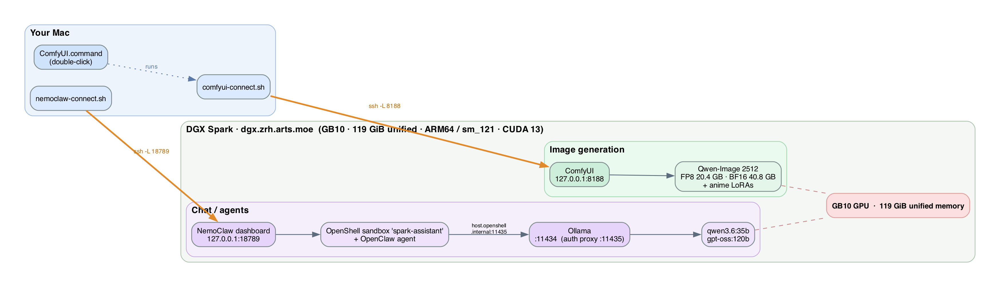

# DGX Spark AI Stack

Local, private AI on the **DGX Spark** (`dgx.zrh.arts.moe`) — open-source LLMs and
anime-capable image generation, reachable from a laptop over an SSH tunnel.

| Capability | Stack | Models |
|---|---|---|
| **Chat / agents** | [NemoClaw](https://docs.nvidia.com/nemoclaw/) + OpenShell sandbox + Ollama | `qwen3.6:35b` (default), `gpt-oss:120b` |
| **Image generation** | [ComfyUI](https://github.com/comfyanonymous/ComfyUI) | Qwen-Image 2512 (FP8 + BF16) + anime LoRAs |

Everything runs **on-device** (no cloud API keys) and is bound to `localhost`,
reached only through an SSH tunnel.

## Architecture



## Hardware / platform
- DGX Spark, **GB10** Grace-Blackwell, **119 GiB unified memory**, 20-core ARM64 (`aarch64`, `sm_121`)
- Ubuntu 24.04, CUDA 13.0, Docker 29.x

## Repo layout
```
client/                  run on your Mac/laptop
  Open ComfyUI.app       double-click → opens via Terminal.app (bypasses Ghostty etc.)
  Open NemoClaw.app      double-click → NemoClaw chat, same terminal-independent way
  ComfyUI.command        double-click → tunnel + open ComfyUI (uses default terminal)
  comfyui-connect.sh     ComfyUI tunnel (port 8188)
  nemoclaw-connect.sh    NemoClaw dashboard tunnel (port 18789, fresh token)
  dgx.conf.example       per-user host/account config (copy → dgx.conf)
  launchers/             AppleScript sources + build.sh for the two .app launchers
server/                  run on the Spark
  comfyui-start.sh       start ComfyUI in a detached tmux session
  nemoclaw-fix-cdi.sh    fix the CDI/plymouth install hang
  nemoclaw-set-model.sh  switch NemoClaw's model (handles the --no-verify quirk)
  build_workflow.py      regenerate the ComfyUI workflow template (opt. per-user)
  comfyui-add-user-workflow.sh  per-user workflow → output/<user>/ folder
  workflows/             ComfyUI workflow template(s)
  test/                  headless generation tests (API)
setup/                   run on the Spark, once
  install-comfyui.sh     venv + torch (cu130/aarch64) + ComfyUI
  download-models.sh     Qwen-Image 2512 + encoders + VAE + anime LoRAs
  enable-multiuser.sh    let other local Spark accounts share the stack
  apply-egress-policy.sh grant the NemoClaw agent web_fetch egress
  policies/internet.yaml the agent's HTTPS egress allowlist (hostname-based)
docs/samples/            example outputs
```

## Start here
- **中文用户？看这个** → [快速上手.md](快速上手.md)（怎么用 `~/` 下那两个连接脚本）
- **Just want to use it?** → [USERGUIDE.md](USERGUIDE.md)
- **More than one person on the Spark?** → [MULTIUSER.md](MULTIUSER.md)
- **Installing / maintaining / rebuilding?** → [ADMINGUIDE.md](ADMINGUIDE.md)
