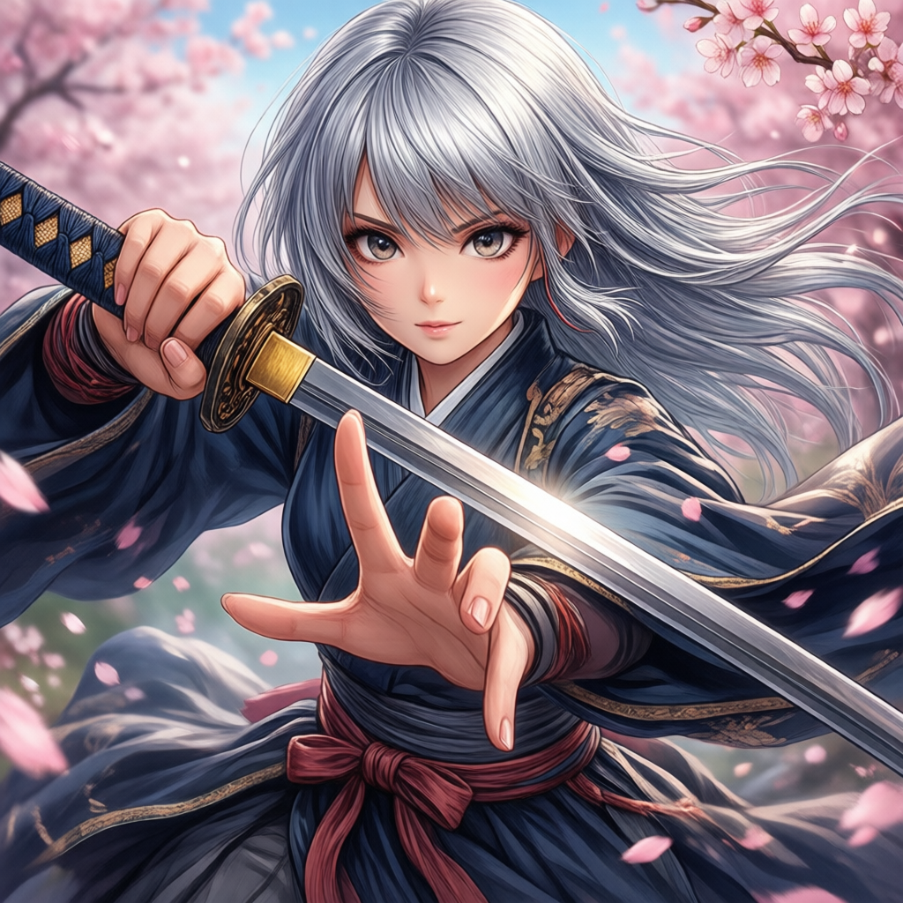
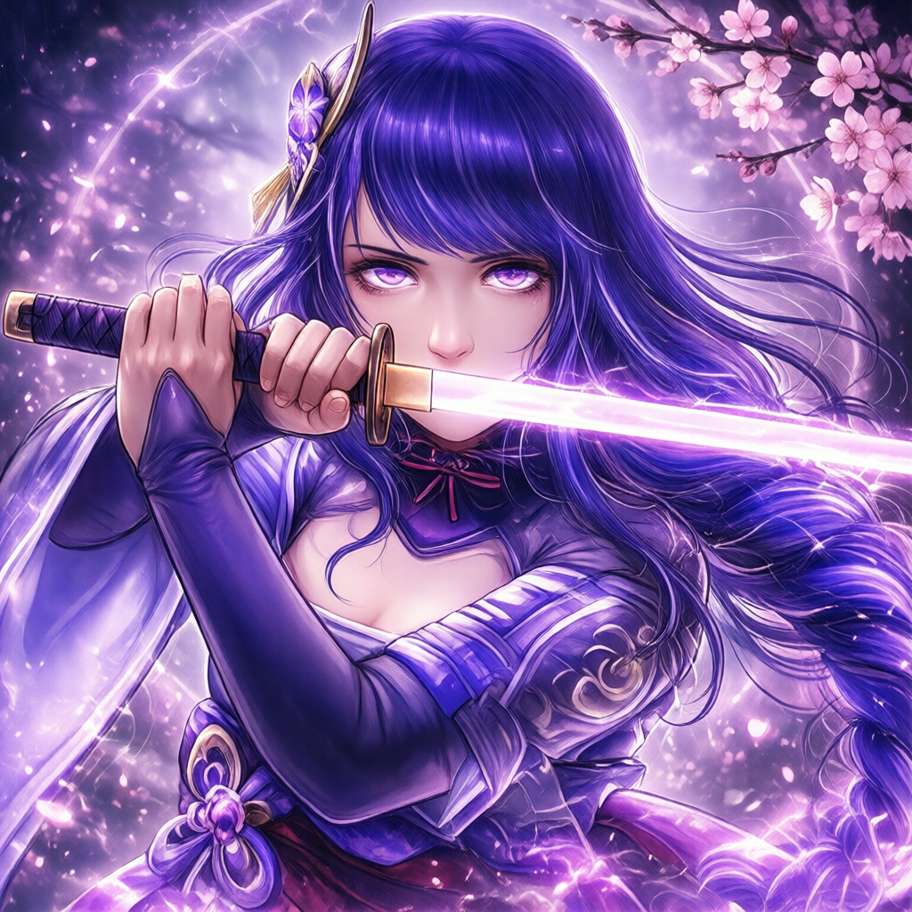

# User Guide

Everything below runs from your **Mac**. The Spark does the heavy lifting; you
just open a tunnel and use a browser. Nothing is exposed to the network — the
SSH tunnel is the only way in.

> One-time: make sure you can `ssh dgx.zrh.arts.moe` without a password prompt
> (SSH key already set up). All scripts default to that host.

---

## 1. Generate images (ComfyUI + Qwen-Image 2512)

### Connect — one click
Double-click **`client/ComfyUI.command`** in Finder.
It makes sure ComfyUI is running on the Spark, opens the tunnel, and pops the UI
at `http://127.0.0.1:8188`.

- Keep the little Terminal window **open** = you stay connected.
- **Close it** (or press Ctrl-C) = tunnel closes.
- Tip: drag `ComfyUI.command` to your Dock for true one-click.

(Prefer the terminal? `bash client/comfyui-connect.sh`. Stop a tunnel with
`bash client/comfyui-connect.sh stop`.)

### Make a picture
1. In ComfyUI, open the **Workflows** menu (left sidebar) → **`Qwen2512-Anime-LoRA`**.
   It's pre-wired: Qwen-Image 2512 (FP8) + an anime LoRA + a tuned sampler.
2. Edit the **positive prompt**. Keep the trigger word at the start:
   - `Qwen Anime, 1girl, silver hair, holding a katana, detailed hands, cherry blossoms, ...`
3. Click **Queue** (or press Ctrl+Enter).
4. The image appears in the UI and is saved on the Spark under
   `~/ComfyUI/output/`.

First generation after a fresh start takes ~70–80 s (it loads the 20 GB model);
after that each image is much faster — the model stays cached.

### Example outputs
| Base 2512 (prompted "anime style") | With the `Qwen Anime` LoRA |
|---|---|
|  |  |

Note the hands — five fingers, no extra/fused digits. Qwen-Image's modern
architecture handles hands far better than older SDXL-era anime models.

### Switch quality / style (all in that one workflow)
| Want | Change |
|---|---|
| **Max quality** | `Load Diffusion Model` node → pick `qwen_image_2512_bf16.safetensors` (slower) |
| **Different anime style** | `LoraLoader` node → `qwen_modern_anime_alfredplpl.safetensors`, and use trigger `Japanese modern anime style` |
| **No LoRA (plain 2512)** | set `LoraLoader` strength to `0`, or bypass the node |
| **Stronger / weaker LoRA** | `LoraLoader` strength `0.5`–`1.0` |

### Prompt tips
- Sampler `euler`, scheduler `simple`, **20 steps**, **CFG 2.5–4.0** work well.
- Qwen follows long, descriptive prompts well — describe pose, clothing, lighting.
- To fight bad hands further, keep the negative prompt:
  `bad hands, extra fingers, fused fingers, missing fingers, deformed`.

---

## 2. Chat / agents (NemoClaw)

### Connect
```bash
bash client/nemoclaw-connect.sh
```
This fetches a **fresh authenticated dashboard URL** (with token) from the Spark,
opens the tunnel, and launches it in your browser. Modes: `--no-open`, `--check`,
`stop`.

### Which model is answering?
- `qwen3.6:35b` — fast, great for everyday agent/tool use (**default**).
- `gpt-oss:120b` — stronger reasoning, a bit slower; first reply waits ~70 s while
  the 65 GB model loads, then it's snappy.

Switching is an admin action (one command on the Spark) — see the Admin Guide,
or ask. Check the current model anytime with `ssh dgx.zrh.arts.moe 'nemoclaw spark-assistant status'`.

---

## Quick reference
| Action | Command (on your Mac) |
|---|---|
| Open ComfyUI | double-click `client/ComfyUI.command` |
| Open ComfyUI (terminal) | `bash client/comfyui-connect.sh` |
| Close ComfyUI tunnel | `bash client/comfyui-connect.sh stop` |
| Open NemoClaw chat | `bash client/nemoclaw-connect.sh` |
| Is image gen healthy? | `bash client/comfyui-connect.sh --check` |
